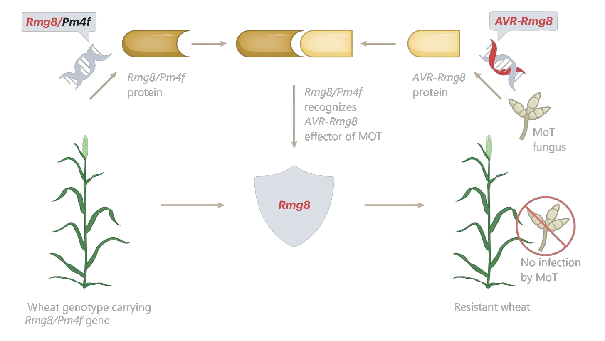
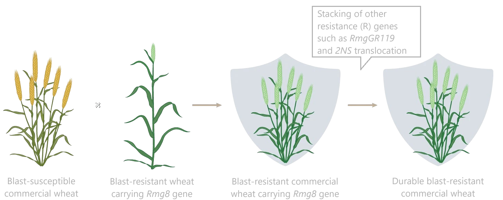

# About

## Welcome to Rojana Binte Azad's Website

Hello! I am Rojana Binte Azad, a passionate microbiology and molecular genetics researcher with a deep commitment to advancing agricultural and biological sciences. My journey began with a fascination for biological systems, leading me to pursue academic and research excellence in plant genetics, microbial interactions, and disease resistance.

With a solid foundation in agricultural science and biotechnology, I have spearheaded projects to improve wheat blast resistance and manage fungal pathogens. As the first woman in my family to pursue a PhD, I aim to inspire future generations to see research as achievable and transformative. In the future, I want to explore the molecular mechanisms of biological systems and contribute to innovative solutions for global challenges.

---

### My Interests
 - Microbial Genomics and Metagenomics
 - Omics approaches
 - Genome editing and Synthetic biology
 - Host-microbes interaction
 - Rapid disease diagnostic
 - CRISPR/Cas system.

# Research

## Overview of My Research

### Combating Wheat Blast for Global Food Security
Wheat is one of the most important crops for ensuring global food security, providing sustenance to billions of people worldwide. However, this critical food source is under threat from a devastating fungal disease called wheat blast. Caused by _Magnaporthe oryzae Triticum_ (MoT), this disease can wipe out entire wheat fields within days under favorable conditions, particularly in warm and humid climates. First identified in Brazil in the 1980s, wheat blast has since spread to South America, Africa, and South Asia, including Bangladesh. Its ability to spread rapidly and resist chemical fungicides makes it a major challenge for farmers and researchers alike.

### The Challenge
Controlling wheat blast with chemical fungicides has proven unreliable. The fungus evolves quickly, developing resistance to these chemicals, leaving farmers with limited options. Traditional breeding methods for disease-resistant varieties are often slow and not always effective, as environmental conditions can weaken the resistance of certain genes. Scientists have discovered 10 wheat blast resistance genes so far, but many lose their effectiveness under high temperatures, a problem that is becoming more pressing due to climate change.

### The Goal
This research aimed to tackle wheat blast by developing a wheat variety that combines two promising resistance genes: _Rmg8_ and _2NS_ translocation. By stacking these genes into a single wheat variety, the goal was to create a durable and long-lasting solution to wheat blast that would remain effective even under challenging environmental conditions.

### The Approach
To achieve this goal, the research focused on advanced breeding techniques such as marker-assisted selection and bioassays. In marker-assisted selection, scientists use specific genetic markers to identify plants carrying the desired resistance genes. This method allows for precise and efficient breeding, ensuring that the resulting plants inherit the desired traits.

The process involved crossing a winter wheat genotype, S-615 (which carries the _Rmg8_ gene), with a Bangladeshi spring wheat variety, BARI Gom 33 (which carries the 2NS translocation gene). The team then carefully selected and tested the offspring over multiple generations to ensure the combined presence of both resistance genes. Field trials were conducted to evaluate the plants' resistance to wheat blast and their overall yield performance.

The identification and detailed characterization of the major resistance gene _Rmg8_ and its evolutionary relationship with the powdery mildew resistance gene _Pm4f_, both of which recognize the common effector gene _AVR-Rmg8_. 

The possible introgression of _Rmg8_ with other R genes for combating wheat blast disease through marker-assisted molecular breeding.

### Key Findings
The research led to the development of 16 advanced wheat lines that successfully combined the _Rmg8_ and 2NS resistance genes. These plants showed significant resistance to wheat blast under real-world field conditions, a critical step toward creating a durable and high-yielding variety for farmers.

Additionally, the study demonstrated that combining resistance genes can be more effective than relying on a single gene, especially in environments where temperature and humidity fluctuate. This finding highlights the importance of gene stacking as a long-term solution to combat diseases like wheat blast.

### Broader Implications
This work not only advances wheat blast research but also contributes to the larger goal of sustainable agriculture. By developing disease-resistant varieties, farmers can reduce their reliance on chemical fungicides, which are expensive, harmful to the environment, and often ineffective. Moreover, these new wheat varieties can help ensure a stable food supply in regions most vulnerable to the impacts of climate change and crop diseases.

### Beyond Wheat Blast
The researcher also explored other innovative approaches to combat plant diseases, such as using natural compounds produced by bacteria to fight fungal infections. For example, a volatile organic compound (VOC) called 3-Methyl-pentanoic acid (3MP), derived from the bacteria _Bacillus safensis_, was studied for its ability to enhance the plant's own defenses against wheat blast. This research opens doors to environmentally friendly and sustainable biocontrol strategies for crop protection.

### Why This Matters
Diseases like wheat blast pose a serious threat to global food security, especially in developing countries where agriculture is a cornerstone of the economy. Research like this not only provides solutions to pressing agricultural problems but also empowers countries like Bangladesh to take proactive steps in protecting their food supply. By integrating cutting-edge genetic techniques with sustainable farming practices, this work offers hope for a future where crops are more resilient, food supplies are secure, and farming is less reliant on harmful chemicals.

In essence, this research serves as a shining example of how science can address real-world challenges, ensuring that humanity is better prepared to feed a growing population in the face of changing climates and evolving pathogens.

## Research Experience

**Identification of Novel Blast Resistant Wheat Lines Carrying _2NS_ Translocation and _Rmg8_ in F3 Population of Introgressed BARI Gom 33**

**Position:** Principal Investigator (PI) of the Innovation Project _(July 2022 - June 2023)_

**Supervisor:** [Prof. Dr. Toffazal Islam](https://en.wikipedia.org/wiki/Tofazzal_Islam)  

**Job Description:** Developing a blast disease-resistant wheat variety by introgressing the *Rmg8* resistance gene from winter wheat genotype S-615 into the *2NS* background of a Bangladeshi spring wheat variety BARI Gom 33, using bioassay and marker-assisted selection to stack two resistance genes in a single genotype.  

**Research Paper:**  Manuscript in progress  

**Techniques Used:**  
- Marker-Assisted Selection (Plant DNA and RNA Extraction PCR with *Rmg8*-specific markers (KM65 and KM171) and a *2NS*-specific marker (VENTRUIP-F/LN2-R), Gel Documentation)  
- Bioassay with a virulent isolate of *MoT* (BTJP4-5)  
- Rapid detection of fungus from infected samples using PCRD strip  

---

**Development of Novel Blast-Resistant Wheat Varieties for Bangladesh by Mutation Breeding **

**Position:** Research Assistant _(January 2022 - June 2023)_

**Supervisor:** [Prof. Dr. Toffazal Islam](https://en.wikipedia.org/wiki/Tofazzal_Islam)

**Job Description:**  Mutagenesis has not been utilized in wheat for blast resistance. Therefore, this study focused on developing resistant lines compared to the control parent through gamma-ray irradiation, X-ray irradiation, and ion beam irradiation, offering potential solutions to address the emerging blast threat.  

**Research Paper:**  Manuscript in progress  

**Techniques Used:**  
- Seed treatment with irradiation  
- Bioassay with a virulent isolate of *MoT* (BTJP4-5)  
- Rapid detection of fungus from infected samples using PCRD strip  

---

**Management of Wheat Blast Disease by Volatile Compounds from Plant Endophytic Bacteria **

**Position:** Research Assistant  _(December 2023 - November 2024)_

**Supervisor:** [Prof. Dr. Dipali Rani Gupta](https://bsmrau.edu.bd/dipali/)

**Job Description:** Developing a biocontrol strategy against blast disease by investigating the anti-fungal activity of 3-Methyl-pentanoic acid (3MP), a VOC produced by *Bacillus safensis*, to induce systemic resistance in wheat.  

**Research Paper:** Manuscript in progress  

**Techniques used:**
- In vitro assay of compound against MoT fungus
- In vivo assay of the compound by inoculating wheat seedlings with a virulent isolate of MoT (BTJP4-5)
- Compound assay in both pot experiment and field experiment

---

**Characterization of *Bipolaris sorokiniana* causing Spot Blotch Disease of wheat and Its Novel Biocontrol Strategies **

**Position:** Research Assistant _(February 2024 - December 2024)_

**Supervisor:** [Prof. Dr. Dipali Rani Gupta](https://bsmrau.edu.bd/dipali/)

**Job Description:** Molecular and pathogenic characterization of *Bipolaris sorokiniana* causing Spot Blotch Disease of wheat. We again explored biological control strategies utilizing bacterial isolates that we previously characterized.  

**Research Paper:** Manuscript in progress  

**Techniques used:**
- Fungal isolation from diseased sample
- Bacteria isolation
- Koch’s postulation
- Fungal DNA extraction
- Bacterial DNA extraction
- Sanger sequencing of fungus using ITS primer
- 16s Sanger sequencing of bacteria
- Oxidase and catalase tests
- Gram staining
- Biofilm formation assays

## Publications & Preprints

1. [Rmg8 gene against wheat blast.](https://doi.org/10.1038/s41477-024-01690-3) Islam, T., **Azad, R.B**. . Nat. Plants 10, 836–837 (2024).
    

        
<strong>Abstract</strong>

        Characterization of <i>Rmg8</i>, the major resistancegene for wheat blast found in common wheat,brought a surprise: it is a variant of <i>Pm4</i>, aresistance gene for powdery mildew disease. Both genes recognize the AVR-<i>Rm8</i> gene ofthe wheat blast fungus <i>Magnaporthe oryzaepathotype Triticum</i> (MoT), which resultsin resistance against this pathogen. This discovery opens avenues for developing wheatvarieties to combat wheat blast disease. 
    

2. [Horizontal gene transfer from plant to whitefly.](https://doi.org/10.1016/j.tibtech.2023.01.007)
Islam, T., **Azad, R. B.**, Kasfy, S. H., Rahman, A. A., & Khan, T. Z. (2023). Trends in Biotechnology, 41(7), 853-856.
    

        
<strong>Abstract</strong>

        The recent discovery of the horizontal transfer of a toxin-neutralizing gene from plant to whitefly (<i>Bemisia tabaci</i>), a polyphagous insect, sparked a new area of study. In this forum, we discuss some potential biotechnological applications of this newly discovered knowledge in the coevolutionary arms race between plants and whitefly.
    

## Presentations

1. [Blast disease resistance of wheat genotypes carrying blast resistance genes _Rmg8_, _Rmggr119_, and _2NS_ translocation in the field.](https://doi.org/10.13140/RG.2.2.30677.23521) Ali, J., Haque, A., **Azad, R.**, Gupta, D., & Islam, T., 5th International Conference on Biotechnology in Health and Agriculture (ICBHA) 2023" Biotechnology for Sustainable Development in Agriculture, Environment and Health" Poster Presentation-Young Emerging Scientist (2023).
    

            
<strong>Abstract</strong>

            Wheat blast caused by a filamentous fungus <i>Magnaportha oryzae Triticum</i> (MoT) has emerged as a potential pandemic threat to global food security. Control of this fungus by chemical fungicides are unreliable due to its quick evolution and development of resistance against the chemicals. The development of a resistant variety is an effective way to combat the destructive fungal pathogen. Ten wheat blast resistance genes are discovered. Among them, seven genes namely, <i>Rmg1-7</i> are ineffective at higher temperatures. The blast resistance gene, <i>2NS</i> translocation has been deployed in the field of South America and Bangladesh. This study for the first-time evaluated blast-resistant performances of the genotypes <i>S615</i>, <i>GR119</i>, and wheat variety BARI Gom 33 that carry blast-resistance genes, <i>Rmg8</i>, <i>RmgGR119</i>, and <i>2NS</i> translocation, respectively in the field conditions, where BARI Gom 26 was used as a susceptible variety. Wheat genotypes/varieties carrying all three genes showed significantly higher but varying levels of blast resistance compared to BARI Gom 26. These results suggest that stacking of these genes in the elite varieties is needed to develop durable blast-resistant wheat varieties under the changing climate scenario in Bangladesh and beyond. Functional analysis of these genes is needed to elucidate the molecular mechanism of resistance under varying environmental conditions.
    

2. [Development of a durable blast resistant wheat variety by stacking of blast-resistance genes, _Rmg8_ and _2NS_ translocation.](https://www.researchgate.net/publication/383213182_Development_of_a_Durable_Blast_Resistant_Wheat_Variety_by_Stacking_of_blast-resistance_genes_Rmg8_and_2NS_Translocation) **Azad, R.**, Muzahid, A., Muzahid, M., Roy, C., Al, A., Rahat, A., Haque, A., Gupta, D., Gupta, & Islam, T., 5th International Conference on Biotechnology in Health and Agriculture (ICBHA) 2023" Biotechnology for Sustainable Development in Agriculture, Environment and Health" Oral Presentation-Young Emerging Scientist (2023).
    

        
<strong>Abstract</strong>

        Wheat is one of the most important crops for global food security. <i>Magnaportha oryzae Triticum</i>, a filamentous fungus that causes wheat blast, has emerged as a potentially catastrophic food security threat in some countries in South America, Africa, and Asia, such as Bangladesh. Developing blast-resistant varieties is considered a long-term solution to this problem. There are limited sources of blast resistance, and no completely blast-resistant variety is available. To mitigate wheat blast, two blast resistance genes, <i>Rmg8</i> and <i>2NS</i> translocation, are thought to be promising candidates for stacking into commercially cultivated varieties. A <i>2NS</i> translocation in BARI Gom-33 has shown some tolerance to wheat blast. This study aimed to develop a durable blast-resistant variety by introducing <i>Rmg8</i> from genotype <i>S615</i> into BARI Gom-33. Eighty F1 seeds of introgressed plants were germinated and sown as individual lines to produce F2 segregating plants. Bioassay-guided and marker-based screening resulted in 11 blast-resistant F2 plants. A further evaluation of these 11 lines containing two resistance genes was carried out in the field for their blast resistance and yield. After bioassay and marker-assisted selection, we obtained 16 plants carrying both resistance genes, <i>Rmg8</i> and <i>2NS</i> translocation. The newly selected lines are resistant to blast as well as showed good agronomic characteristics. Selfing of the F4 population would result in promising lines carrying both genes along with superior agronomic characteristics that would be useful for the development of a durable blast-resistant wheat variety to combat the wheat blast disease in Bangladesh.
    

3.  [Marker-assisted breeding for a durable blast resistant wheat variety by introgression of _RMG8_ gene into bari gom-33 carrying a _2NS_ translocation.](https://www.researchgate.net/publication/370943598_Marker-assisted_breeding_for_a_durable_blast_resistant_wheat_variety_by_introgression_of_Rmg8_gene_into_BARI_Gom-33_carrying_a_2NS_translocation) **Azad, R.**, Muzahid, A., Roy, P., Rahat, A., Haque, M., Gupta, D., & Islam, T., 5th Young Scientist Congress 25-27 November, 2022, Bangladesh Academy of Sciences, Dhaka - "Young Scientist for Health and Environment" Poster Presentation (2022).
    

        
<strong>Abstract</strong>

        Wheat is an important crop for world food security and also for Bangladesh. Recently, a fungal disease, wheat blast, caused by a filamentous fungus <i>Magnaporthe oryzae Triticum</i> has emerged as a destructive disease of wheat, which poses serious threat to food security in many countries including Bangladesh. Breeding for blast-resistant varieties must be a long-term solution to this fungus. Among the blast resistance genes discovered, two genes, <i>Rmg8</i> and <i>2NS</i> translocation are thought to be promising candidates to be introgressed into the commercially cultivated variety for the mitigation of wheat blast. BARI GOM-33 carrying a 2NS translocation has shown moderate tolerance to the wheat blast disease. The aim of this study was to introgress Rmg8 gene from genotype S615 into the BARI Gom-33 for the development of a durable blast resistant variety. After successful crossing, 61 F1 seeds from introgressed lines were sown in a field and harvested to obtain F2 segregating generation. Marker-based and bioassay-guided screening of F2 plants resulted in 11 blast resistant plants along with good agronomic characteristics. The lines carrying two resistant genes are ready to be evaluated again in the field for their blast resistance and yield. It is expected that segregating F3 generation would provide more stable lines carrying both genes along with superior agronomic characteristics that would be utilized for the development of blast resistant wheat variety.
    

# Academics

## Work Experience

- [Research Management Wing (RMW), Bangabandhu Sheikh Mujibur Rahman Agricultural University (BSMRAU)](https://www.researchgate.net/profile/Rojana-Azad) - (_January 2023 - July 2024_)
  - Principal Investigator 
  - I led the development of blast-resistant wheat varieties through bioassays, field tests, and marker-assisted breeding.
  
- [Institute of Biotechnology and Genetic Engineering (IBGE), Bangabandhu Sheikh Mujibur Rahman Agricultural University (BSMRAU)](https://ibge.bsmrau.edu.bd/) - (_January 2022 - December 2024_)
  - Research Assistant (RA) under [Dr. Tofazzal Islam](https://en.wikipedia.org/wiki/Tofazzal_Islam)
  - I conducted pathogen characterization, fungal management research, and resistance screening.  

---

## Education

### Graduate  

   - **Master of Science, Biotechnology and Genetic Engineering** - (_January 2022 - December 2024_)
     - Institute of Biotechnology (IBGE), Bangabandhu Sheikh Mujibur Rahman Agricultural University BSMRAU 
          - Academic Thesis: <ins>Resistance and yield performance on advanced wheat lines carrying 2NS translocation and _RMG8_ gene </ins>
          - CGPA: **4.00/4.00** 

### Undergraduate  

   - **Bachelor of Science, Agriculture** - (_January 2017 - December 2021_)
     -  Bangabandhu Sheikh Mujibur Rahman Agricultural University (BSMRAU) 
        - CGPA: **3.879/4.00** 
   
---

## Awards, Prizes, and Scholarships

- **National Science and Technology Fellowship**, *Ministry of Science and Technology, People's Republic of Bangladesh* (2022-2023)
  
- **BSMRAU Innovation Fund**, *Research Management Wing (RMW), BSMRAU* (2023)
  
- **Merit Scholarship from Faculty of Agriculture**, *BSMRAU* (2017-2020)
  - At undergraduate education level
- **Merit Scholarship from Faculty of Graduate Studies**, *BSMRAU* (2022)

<a href="#top">Go to top</a>

